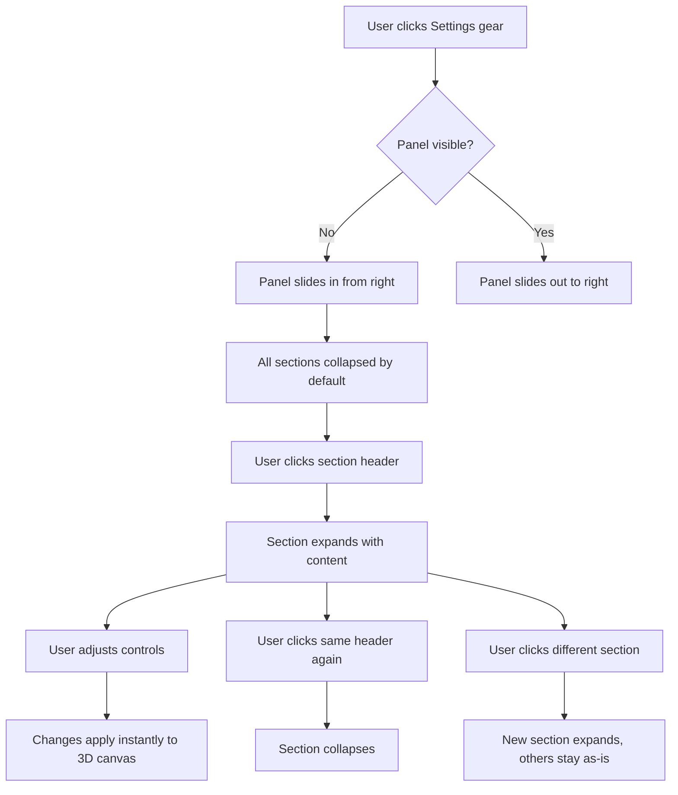

# Design Proposal: Right-Side Settings Panel

## Overview

Replace the current floating bottom-right controls panel (tabbed, cramped) with a
full-height, right-docked properties panel inspired by Spline. All settings live in
collapsible sections within a single scrollable column. The external cursor-orbit
toggle button is absorbed into a new "Interaction" section. A settings gear button
in the bottom-right opens/closes the panel with a slide animation.

## Target Viewport(s)

- [x] Desktop (1280px+)
- [ ] Tablet (768px) -- future consideration
- [ ] Mobile (375px) -- future consideration

---

## Information Architecture

```
Settings Panel (right-docked, ~300px wide)
|
+-- Shape
|   +-- Depth (Slider)
|   +-- Smoothness (Slider)
|   +-- Color (swatches + picker)
|   +-- Background Color (swatches + picker)
|
+-- Transform
|   +-- Rotation X (number input)
|   +-- Rotation Y (number input)
|   +-- Rotation Z (number input)
|   +-- Zoom / Camera Distance (slider)
|   +-- [Reset Position] button
|
+-- Material
|   +-- Preset Grid (visual tiles)
|   +-- Advanced (collapsible, or auto-shown when preset = "default")
|   |   +-- Metalness (Slider)
|   |   +-- Roughness (Slider)
|   +-- Opacity (Slider)
|   +-- Wireframe (Switch)
|
+-- Texture
|   +-- Preset Grid (circular thumbnails)
|   +-- [Upload] [Clear] buttons
|   +-- Transform (shown when texture active)
|       +-- Repeat (Slider)
|       +-- Rotation (Slider)
|       +-- Offset X (Slider)
|       +-- Offset Y (Slider)
|
+-- Animation
|   +-- Type selector (segmented pills)
|   +-- Speed (Slider) -- shown when type != none
|   +-- Reverse (Switch) -- shown for applicable types
|
+-- Interaction
|   +-- Cursor Orbit (Switch)
|   +-- Draggable (Switch) -- future
|   +-- Scroll Zoom (Switch) -- future
|
+-- Lighting
    +-- Key Light X (Slider)
    +-- Key Light Y (Slider)
    +-- Key Light Z (Slider)
    +-- Key Intensity (Slider)
    +-- Ambient Intensity (Slider)
    +-- Shadows (Switch)
```

---

## User Flow



---

## Wireframes

### 1. Full Page Layout (Panel Open)

```
+-------------------------------------------------------------------------+
|  3DSVG                                                   [Export]       |
+-------------------------------------------------------------------------+
|                                                                         |
|  +---+  +----------+                                 +---------------+  |
|  |[D]|  |          |                                 |  Settings     |  |
|  |[T]|  |  Input   |                                 |               |  |
|  |[C]|  |  Panel   |         3D Canvas               |  > Shape      |  |
|  |[F]|  |          |        (full bleed)             |  > Transform  |  |
|  +---+  +----------+                                 |  > Material   |  |
|                                                      |  > Texture    |  |
|                                                      |  > Animation  |  |
|                                                      |  > Interact.  |  |
|                                                      |  > Lighting   |  |
|                                                      |               |  |
|                                                      +---------------+  |
|                                                                         |
|                                                             [Gear btn]  |
+-------------------------------------------------------------------------+
```

Notes:
- Panel is `position: absolute`, right: 0, top: 0, bottom: 0
- Glassmorphic: `bg-card/70 backdrop-blur-xl border-l border-white/[0.06]`
- Width: ~300px (w-[300px])
- The gear button remains visible at bottom-right, below the panel
- Panel slides in/out with `framer-motion` (x: 300 -> 0)

---

### 2. All Sections Collapsed

```
+-----------------------------------------------+
|  Settings                               [X]   |
+---------+-------------------------------------+
|                                               |
|  +-------------------------------------------+|
|  | [Cube icon]   Shape                     > ||
|  +-------------------------------------------+|
|                                               |
|  +-------------------------------------------+|
|  | [Move icon]   Transform                 > ||
|  +-------------------------------------------+|
|                                               |
|  +-------------------------------------------+|
|  | [Circle icon] Material                  > ||
|  +-------------------------------------------+|
|                                               |
|  +-------------------------------------------+|
|  | [Image icon]  Texture                   > ||
|  +-------------------------------------------+|
|                                               |
|  +-------------------------------------------+|
|  | [Play icon]   Animation                 > ||
|  +-------------------------------------------+|
|                                               |
|  +-------------------------------------------+|
|  | [Orbit icon]  Interaction               > ||
|  +-------------------------------------------+|
|                                               |
|  +-------------------------------------------+|
|  | [Sun icon]    Lighting                  > ||
|  +-------------------------------------------+|
|                                               |
+-----------------------------------------------+
```

Component mapping:
- Panel container: `div` with glassmorphic styles
- Header row: "Settings" label (text-sm, text-muted-foreground) + close [X] button (ghost, size="icon")
- Each section row: `CollapsibleTrigger` with icon + label + ChevronRight
- Section icons: Lucide icons (Box, Move3d, Palette, Image, Play, Orbit, Sun)
- Chevron rotates 90deg when expanded
- `border-b border-white/[0.06]` separates each section header
- Section headers: `text-sm font-medium text-foreground`
- Icons: `h-4 w-4 text-muted-foreground`

Motion:
- Panel entrance: slide from right (x: 300 -> 0, duration: 200ms)
- Section expand: `CollapsibleContent` with height animation (built into Radix)

---

### 3. Shape Section Expanded

```
+-----------------------------------------------+
|  Settings                               [X]   |
+---------+-------------------------------------+
|                                               |
|  +-------------------------------------------+|
|  | [Cube icon]   Shape                     v ||
|  +-------------------------------------------+|
|  |                                           ||
|  |  Depth                             1.0    ||
|  |  [=======O-----------------------]        ||
|  |                                           ||
|  |  Smoothness                        60%    ||
|  |  [=============O-----------------]        ||
|  |                                           ||
|  |  Color                                    ||
|  |  (O)(O)(O)(O)(O)(O)(O)                    ||
|  |  [##]  #4f46e5                            ||
|  |                                           ||
|  |  Background                               ||
|  |  (O)(O)(O)(O)(O)(O)(O)                    ||
|  |  [##]  #4f46e5                            ||
|  |                                           ||
|  +-------------------------------------------+|
|                                               |
|  +-------------------------------------------+|
|  | [Move icon]   Transform                 > ||
|  +-------------------------------------------+|
|                                               |
|  +-------------------------------------------+|
|  | [Circle icon] Material                  > ||
|  +-------------------------------------------+|
|  |          ... remaining collapsed ...      ||
+-----------------------------------------------+
```

Component mapping:
- Depth/Smoothness: `Label` (text-xs, text-muted-foreground) + value span (text-xs, font-mono) + `Slider`
- Color swatches: Row of circular buttons (h-6 w-6 rounded-full), active has `ring-2 ring-primary`
- Color picker: Hidden `<input type="color">` behind a colored square (h-8 w-8 rounded-lg) + hex label
- Same pattern for Background color
- All within `CollapsibleContent` with `space-y-4 p-4` padding

---

### 4. Transform Section Expanded

```
+-----------------------------------------------+
|  Settings                               [X]   |
+---------+-------------------------------------+
|                                               |
|  +-------------------------------------------+|
|  | [Cube icon]   Shape                     > ||
|  +-------------------------------------------+|
|                                               |
|  +-------------------------------------------+|
|  | [Move icon]   Transform                 v ||
|  +-------------------------------------------+|
|  |                                           ||
|  |  Rotation                                 ||
|  |  +-----+  +-----+  +-----+               ||
|  |  |X  0 |  |Y  0 |  |Z  0 |               ||
|  |  +-----+  +-----+  +-----+               ||
|  |                                           ||
|  |  Zoom                              5.0    ||
|  |  [=======O-----------------------]        ||
|  |                                           ||
|  |  [Reset Position]                         ||
|  |                                           ||
|  +-------------------------------------------+|
|                                               |
|  +-------------------------------------------+|
|  | [Circle icon] Material                  > ||
|  +-------------------------------------------+|
|  |          ... remaining collapsed ...      ||
+-----------------------------------------------+
```

Component mapping:
- Rotation row: 3x `Input` (type="number") in a flex row, each with X/Y/Z prefix label
  - Inputs: `w-full h-8 text-xs font-mono` in a `div` with a `text-muted-foreground` axis letter
  - Spline-style: axis letter (X, Y, Z) sits inside the input as a prefix
- Zoom: `Slider` with label + value display
- Reset button: `Button` variant="outline" size="sm", full width, with RotateCcw icon
- Spacing: `space-y-4 p-4`

Note: Rotation and Zoom are NEW controls. The current codebase does not expose these
as state -- they will require new state variables in page.tsx and corresponding props
passed to SVGTo3DCanvas. The camera distance/zoom can drive the Three.js camera position.

---

### 5. Material Section Expanded

```
+-----------------------------------------------+
|  Settings                               [X]   |
+---------+-------------------------------------+
|  |          ... Shape/Transform collapsed ... ||
|                                               |
|  +-------------------------------------------+|
|  | [Circle icon] Material                  v ||
|  +-------------------------------------------+|
|  |                                           ||
|  |  Preset                                   ||
|  |  +------+ +------+ +------+ +------+     ||
|  |  | Def  | | Plas | | Metl | | Glas |     ||
|  |  +------+ +------+ +------+ +------+     ||
|  |  +------+ +------+ +------+ +------+     ||
|  |  | Rubb | | Chrm | | Gold | | Clay |     ||
|  |  +------+ +------+ +------+ +------+     ||
|  |  +------+ +------+                        ||
|  |  | Emis | | Holo |                        ||
|  |  +------+ +------+                        ||
|  |                                           ||
|  |  Opacity                           1.00   ||
|  |  [===============================O]       ||
|  |                                           ||
|  |  Wireframe                        [  ]    ||
|  |                                           ||
|  |  v Advanced                               ||
|  |  +---------------------------------------+||
|  |  |  Metalness                      0.00  |||
|  |  |  [O-----------------------------]     |||
|  |  |                                       |||
|  |  |  Roughness                      0.50  |||
|  |  |  [==============O---------------]     |||
|  |  +---------------------------------------+||
|  |                                           ||
|  +-------------------------------------------+|
|                                               |
|  +-------------------------------------------+|
|  | [Image icon]  Texture                   > ||
|  +-------------------------------------------+|
|  |          ... remaining collapsed ...      ||
+-----------------------------------------------+
```

Component mapping:
- Preset grid: 4-column grid of square tiles (h-14 w-full rounded-md)
  - Each tile: abbreviated label (text-xs), subtle gradient/color to hint at material look
  - Active tile: `ring-2 ring-primary bg-accent`
  - Inactive: `bg-muted/50 border border-white/[0.06] hover:bg-accent/30`
- Opacity: `Slider` with `Label` + mono value
- Wireframe: `Label` + `Switch` in a flex row (justify-between)
- Advanced: nested `Collapsible` for Metalness/Roughness
  - These override the preset values -- label says "Advanced" with ChevronDown
  - Only meaningful when user wants manual fine-tuning
- Spacing: `space-y-4 p-4`

---

### 6. Texture Section Expanded

```
+-----------------------------------------------+
|  +-------------------------------------------+|
|  | [Image icon]  Texture                   v ||
|  +-------------------------------------------+|
|  |                                           ||
|  |  Preset                                   ||
|  |  (O)(O)(O)(O)(O)                          ||
|  |  (O)(O)(O)(O)(O)                          ||
|  |                                           ||
|  |  [Upload]  [Clear]                        ||
|  |                                           ||
|  |  v Transform  (visible when texture set)  ||
|  |  +---------------------------------------+||
|  |  |  Repeat X                       1.0x  |||
|  |  |  [=======O-----------------------]    |||
|  |  |                                       |||
|  |  |  Repeat Y                       1.0x  |||
|  |  |  [=======O-----------------------]    |||
|  |  |                                       |||
|  |  |  Rotation                         0   |||
|  |  |  [==============O---------------]     |||
|  |  |                                       |||
|  |  |  Offset X                       0.00  |||
|  |  |  [==============O---------------]     |||
|  |  |                                       |||
|  |  |  Offset Y                       0.00  |||
|  |  |  [==============O---------------]     |||
|  |  +---------------------------------------+||
|  |                                           ||
|  +-------------------------------------------+|
+-----------------------------------------------+
```

Component mapping:
- Texture presets: circular thumbnails (h-10 w-10 rounded-full), same as current
- Upload: `Button` variant="outline" size="sm" with Upload icon
- Clear: `Button` variant="outline" size="sm" with Eraser icon (only shown when texture active)
- Transform sub-section: `Collapsible`, auto-expanded when a texture is active
- All sliders follow the standard pattern: `Label` + mono value + `Slider`

---

### 7. Animation Section Expanded

```
+-----------------------------------------------+
|  +-------------------------------------------+|
|  | [Play icon]   Animation                 v ||
|  +-------------------------------------------+|
|  |                                           ||
|  |  Type                                     ||
|  |  [None] [Spin] [Float] [Pulse]            ||
|  |  [Wobble] [Swing] [Spin+Float]            ||
|  |                                           ||
|  |  Speed                             1.0x   ||
|  |  [=======O-----------------------]        ||
|  |                                           ||
|  |  Reverse                          [  ]    ||
|  |                                           ||
|  +-------------------------------------------+|
+-----------------------------------------------+
```

Component mapping:
- Animation type: Segmented pill buttons in a flex-wrap row
  - Active: `bg-primary text-primary-foreground`
  - Inactive: `bg-muted/50 text-muted-foreground hover:bg-accent/30`
  - Each pill: `rounded-full px-3 py-1 text-xs`
- Speed: `Slider` (shown when type != "none")
- Reverse: `Switch` (shown for applicable animation types: spin, spinFloat, wobble, swing)

---

### 8. Interaction Section Expanded

```
+-----------------------------------------------+
|  +-------------------------------------------+|
|  | [Orbit icon]  Interaction               v ||
|  +-------------------------------------------+|
|  |                                           ||
|  |  Cursor Orbit                     [ON]    ||
|  |                                           ||
|  |  Draggable                        [  ]    ||
|  |                                           ||
|  |  Scroll Zoom                      [  ]    ||
|  |                                           ||
|  +-------------------------------------------+|
+-----------------------------------------------+
```

Component mapping:
- Each row: `Label` (text-xs) + `Switch` in a flex row (justify-between)
- Cursor Orbit: defaults to ON (matching current behavior)
- Draggable / Scroll Zoom: future features, can be disabled/hidden initially

---

### 9. Lighting Section Expanded

```
+-----------------------------------------------+
|  +-------------------------------------------+|
|  | [Sun icon]    Lighting                  v ||
|  +-------------------------------------------+|
|  |                                           ||
|  |  Key Light Position                       ||
|  |  +-----+  +-----+  +-----+               ||
|  |  |X 5.0|  |Y 5.0|  |Z 5.0|               ||
|  |  +-----+  +-----+  +-----+               ||
|  |                                           ||
|  |  Key Intensity                     1.5    ||
|  |  [==========O--------------------]        ||
|  |                                           ||
|  |  Ambient                           0.40   ||
|  |  [=====O-------------------------]        ||
|  |                                           ||
|  |  Shadows                          [ON]    ||
|  |                                           ||
|  +-------------------------------------------+|
+-----------------------------------------------+
```

Component mapping:
- Light position: Same 3-input row pattern as Transform rotation (X/Y/Z `Input` fields)
- Key Intensity: `Slider` (0-5, step 0.1)
- Ambient: `Slider` (0-2, step 0.05)
- Shadows: `Switch`

---

## States and Transitions

### Panel States

```
+----------+    gear click    +----------+   gear click    +----------+
|  Closed  | --------------> |   Open   | --------------> |  Closed  |
+----------+                 +----------+                 +----------+
                                  |
                             scrollable
                             sections expand/collapse
```

### Section States

```
+-----------+   click header   +------------+   click header   +-----------+
| Collapsed | ---------------> |  Expanded  | ---------------> | Collapsed |
+-----------+                  +------------+                  +-----------+
      |                              |
  shows: icon + title + >        shows: icon + title + v
                                 + section content
```

### Conditional Visibility Rules

| Control                    | Visible When                          |
|----------------------------|---------------------------------------|
| Speed slider (Animation)   | animation type != "none"              |
| Reverse toggle (Animation) | type is spin/spinFloat/wobble/swing   |
| Advanced material sliders  | "Advanced" collapsible is opened      |
| Texture transform sliders  | a texture is active (textureUrl set)  |
| Clear texture button       | a texture is active                   |

---

## Interactions and Motion

### Panel Open/Close

```
Panel Open:
  - Container: slide-in from right (x: 300px -> 0, duration: 200ms, ease-out)
  - Content: fade-in (opacity: 0 -> 1, delay: 50ms, duration: 150ms)

Panel Close:
  - Container: slide-out to right (x: 0 -> 300px, duration: 150ms, ease-in)
  - Content: fade-out (opacity: 1 -> 0, duration: 100ms)
```

### Section Expand/Collapse

```
Expand:
  - Height animates from 0 to auto (Radix Collapsible handles this)
  - Content: fade-up (opacity: 0 -> 1, y: 4px -> 0, duration: 150ms)
  - Chevron: rotate 0deg -> 90deg (duration: 150ms)

Collapse:
  - Height animates from auto to 0
  - Chevron: rotate 90deg -> 0deg (duration: 150ms)
```

### Control Interactions

```
- Slider drag: instant value update, no animation needed
- Switch toggle: built-in shadcn transition
- Color swatch hover: scale to 1.1 (hover-scale)
- Color swatch click: ring appears (ring-2 ring-primary)
- Material preset tile hover: hover-lift + bg-accent/30
- Animation pill hover: bg-accent/30
- Section header hover: bg-white/[0.03] subtle highlight
```

### Gear Button

```
- When panel closed: default ghost icon button
- When panel open: text-primary highlight (active state)
- Tap: tap-scale (scale 0.95 on press)
```

---

## Edge Cases and Error States

### Panel Overflow
- When many sections expanded, content exceeds viewport height
- Solution: `ScrollArea` wraps all section content; header stays pinned
- Scroll indicator (subtle gradient fade) at bottom when more content below

### No SVG Loaded
- All settings still functional (they apply to the default/empty state)
- No special empty state needed for the settings panel itself

### Texture Upload Error
- If file is not a valid image, show a `Toast` with error message
- Texture section stays in its previous state

### Very Small Viewport (< 1024px wide)
- Panel overlaps canvas (acceptable for desktop-first)
- Future: consider responsive breakpoint to hide panel and use a sheet/drawer

### Keyboard Accessibility
- Tab through section headers to expand/collapse
- Arrow keys work within sliders (built into shadcn Slider)
- Switch toggleable with Space key
- Number inputs accept keyboard entry

---

## Implementation Notes

### New State Variables Needed (page.tsx)

| Variable        | Type     | Default | Purpose                        |
|-----------------|----------|---------|--------------------------------|
| `rotationX`     | number   | 0       | Manual X rotation override     |
| `rotationY`     | number   | 0       | Manual Y rotation override     |
| `rotationZ`     | number   | 0       | Manual Z rotation override     |
| `cameraZoom`    | number   | 5       | Camera distance from origin    |
| `draggable`     | boolean  | false   | Enable drag interaction        |
| `scrollZoom`    | boolean  | false   | Enable scroll-to-zoom          |

### Changes to Existing Components

1. **page.tsx**: Replace `ControlsPanel` with new `SettingsPanel` component.
   Remove the separate cursor-orbit toggle button. Move `cursorOrbit` state
   into the Interaction section of the new panel.

2. **controls-panel.tsx**: Will be replaced entirely by `settings-panel.tsx`.

3. **SVGTo3DCanvas**: Will need new props for rotation overrides and zoom.

### Panel Component Structure

```
settings-panel.tsx
|
+-- SettingsPanel (main container)
    +-- ScrollArea
        +-- ShapeSection (Collapsible)
        +-- TransformSection (Collapsible)
        +-- MaterialSection (Collapsible)
        +-- TextureSection (Collapsible)
        +-- AnimationSection (Collapsible)
        +-- InteractionSection (Collapsible)
        +-- LightingSection (Collapsible)
```

Each section is a self-contained `Collapsible` with a consistent header pattern:
`icon + title + spacer + chevron`.

### Glassmorphic Styling (Consistent with Existing UI)

```
Container:
  bg-card/70
  backdrop-blur-xl
  border-l border-white/[0.06]
  shadow-[0_8px_32px_oklch(0_0_0/0.4)]

Section headers:
  px-4 py-3
  border-b border-white/[0.06]
  hover:bg-white/[0.02]
  transition-colors

Section content:
  p-4
  space-y-4
```

---

## Open Questions

1. **Default expanded sections**: Should any section(s) start expanded when the
   panel first opens? Suggestion: Shape expanded by default since it has the
   most commonly tweaked controls.

2. **Transform implementation**: Rotation X/Y/Z and Zoom require new Three.js
   camera/object controls. Should these override the orbit controls, or work
   in addition to them?

3. **Material preset visuals**: Should each preset tile show a tiny 3D sphere
   preview (expensive to render) or just a label with a color/gradient hint?

4. **Panel memory**: Should the panel remember which sections were expanded
   between open/close cycles? Suggestion: Yes, store in component state.

5. **Draggable and Scroll Zoom**: These are listed as future features in the
   Interaction section. Should they be shown as disabled controls or hidden
   entirely until implemented?
